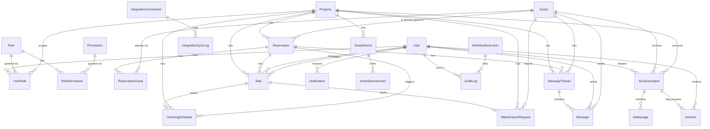

# Entity-Relationship Diagram

Source of truth: `packages/database/prisma/schema.prisma`. This diagram and narrative are kept in sync with that file — if they drift, the schema wins.

Enum-heavy fields (status, type, priority, etc.) and pure attribute columns are omitted from the diagram for readability — see `schema.prisma` for the full field list per model.

## Non-obvious relationships, explained

**`Task` / `CleaningSchedule` / `MaintenanceRequest`.** `Task` is the canonical assignment/status/Asana-sync record shared across all ops work. `CleaningSchedule` and `MaintenanceRequest` each optionally own exactly one `Task` via a unique foreign key (`taskId`), holding domain-specific detail (scheduled times, cleaning type; category, severity, resolution notes) without duplicating workflow-state logic (status, assignee, due date, Asana sync) three times. When you need "what's assigned to this cleaner today," you query `Task`; when you need "what kind of cleaning is this," you join to `CleaningSchedule`.

**`UserRole` and property scoping.** A single `UserRole` table models both global role grants (`propertyId = null`, e.g. `admin`, `ops_manager`) and property-scoped grants (`propertyId` set, e.g. a `cleaner` assigned to two specific properties). Permission checks (`@stayw/auth`) union permissions from any matching global role plus any role scoped to the property being checked. See ADR-0004.

**`Reservation.primaryGuestId` vs. `ReservationGuest`.** `primaryGuestId` is a direct FK for the common case (single-guest queries, notifications) so most code doesn't need to join through the `ReservationGuest` many-to-many table. `ReservationGuest` exists to support multi-guest bookings (`isPrimary` flags which guest is the `primaryGuestId`, kept in sync by the reservation service).

**`AuditLog.workflowExecutionId` and `correlationId` tracing.** `WorkflowExecution.correlationId` is generated when a workflow is triggered and threads through `AuditLog.metadata`, `IntegrationSyncLog`, and the n8n callback payload. `AuditLog.workflowExecutionId` is an explicit typed FK (not buried in `metadata`) linking an audit entry to the automation that caused it, distinguishing user-initiated changes (`actorType = USER`) from workflow-initiated ones (`actorType = WORKFLOW`). See ADR-0005.

**`SmartDeviceEvent` is not `AuditLog`.** Device telemetry (lock/unlock, temperature readings) is high-volume and not a user-driven action, so it's kept in its own table rather than polluting the audit trail. Retention/partitioning for this table is a known future scalability item, not solved in Phase 1.

**No Postgres RLS.** All relationships above are enforced at the application layer (Prisma + `@stayw/auth`), not via Postgres Row Level Security — see ADR-0003 for why.

**`AiAction` and its state machine.** An `AiAction` row is created by `@stayw/ai`'s Tool Registry when a tool registered with `requiresApproval: true` is invoked — it captures the proposed call (`toolName`, `proposedInput`, `reasoning`, `riskLevel`) before anything runs. `conversationId` is nullable because a proposal isn't required to originate from a conversational turn (e.g. a future scheduled/automated proposal). `status` moves `PENDING → APPROVED|REJECTED → (if APPROVED) EXECUTED|EXECUTION_FAILED`; `reviewedByUserId`/`reviewedAt` capture the human sign-off, `executedAt`/`executionResult`/`executionError` capture the outcome once a handler actually runs. This is deliberately separate from `AuditLog`: `AuditLog` records what _did_ happen; `AiAction` records what the AI _proposed_, which may never be approved. See ADR-0007.
