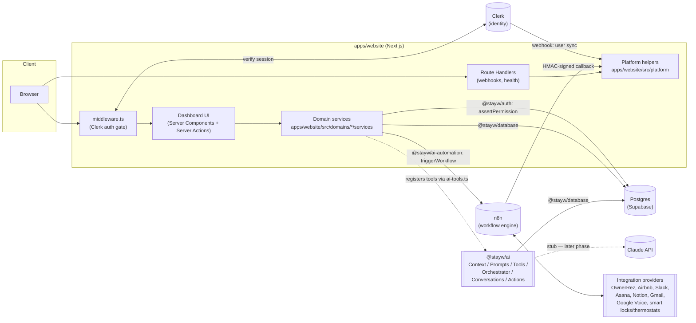

# System Architecture

This is the top-level map of the StayWhile Operations Platform's architecture as of Phase 1 (Architecture & Foundation) plus its subsequent architectural refinement (DDD reorganization, AI platform layer, Integration SDK — ADRs 0006-0008). Individual decisions are recorded in `03 Documentation/adr/` — this document synthesizes them into one picture and covers what isn't decision-specific (data flow, folder structure, scalability posture).

## System overview



## Layers

### Frontend

Next.js 15 App Router in `apps/website`, React Server Components by default, Server Actions for mutations, Tailwind CSS (`@stayw/tailwind-config` preset) for styling, `@stayw/ui` for components shared across pages. See ADR-0001.

### Backend

No separate backend service — `apps/website`'s Route Handlers (`app/api/**`) and Server Actions _are_ the backend. See ADR-0001 for the rationale and the explicit revisit trigger.

### Database

PostgreSQL (Supabase in production, local Postgres in dev) via Prisma. Full schema in `packages/database/prisma/schema.prisma`; see `03 Documentation/architecture/erd.md` for the diagram and ADR-0003 for the ORM/RLS decision.

### Authentication & authorization

Clerk for identity, `@stayw/auth` for RBAC, enforced exclusively in the service layer. See ADR-0004.

### AI layer

`@stayw/ai` — the AI platform layer, distinct from `@stayw/ai-automation` (deterministic n8n triggering, see below). Seven components: Context Engine (real — pluggable provider registry), Prompt Library (real — versioned templates), Tool Registry (real — `registerTool`/`executeTool`, enforces the approval gate), Conversation Context (real, against `AiConversation`/`AiMessage`), Action Approval Framework (real, against the new `AiAction` model), Orchestrator (real plumbing — context → prompt → persist → model call → persist), and Knowledge Retrieval (interface + `NotImplementedError` stub, real vector-store-backed retrieval deferred). See ADR-0007.

Real Claude wiring is the one piece still deferred: `NotImplementedClaudeClient` throws until a later phase fills in the actual model call — everything around it is real and tested today. Tools registered with `requiresApproval: true` never execute directly; `executeTool()` proposes an `AiAction` instead, and a human calls `approveAction`/`rejectAction` before anything runs — the AI layer does not get a bypass around authorization, mirroring the service-layer/RBAC pattern used everywhere else. `packages/mcp-servers/src/shared/register-tools.ts` exposes the same Tool Registry over MCP, routing every `CallTool` through the identical `executeTool()` gate.

### Workflow engine

n8n, triggered from the backend via signed webhooks, calling back via a signed webhook. See ADR-0005.

### Integrations

`@stayw/integrations` holds one client folder per provider (OwnerRez, Airbnb, Slack, Asana, Notion, Gmail, Google Voice, Yale, August, Nest, Ecobee, Cielo), all structural stubs in this phase (`NotImplementedError`) — see that package's README. Every client implements `BaseIntegrationClient` plus whichever capability interfaces apply (`SyncCapable`/`WebhookReceivable`/`MessagingCapable`/`MediaUploadCapable`), declared via a `capabilities` array and narrowed safely at call sites with type guards — see ADR-0008 for the capability matrix. Each provider's `IntegrationConnection` row (schema) tracks connection status and a _reference_ to its credentials (never plaintext tokens in the database — see the field-level comment in `schema.prisma`).

### Background jobs / async work

No separate job queue — n8n handles all of it, per ADR-0001 and ADR-0005.

### Notifications

`Notification` rows are created with `status = PENDING` and follow the same trigger-workflow pattern as any other automation; n8n performs the actual Slack/Email/SMS send and calls back to update status. See the ERD's Notifications section and ADR-0005.

### Audit logging

`AuditLog` is written by every mutating service function (`recordAudit`-shaped call at the end of the business logic step, per the service-layer pattern in `CODING_STANDARDS.md`). Captures actor, action, entity, before/after state, and links to the `WorkflowExecution` that caused it, if any.

## Folder structure

```
apps/website/            Next.js app — dashboard UI + API/webhooks (the only deployable app, see ADR-0001)
  src/domains/<name>/    Business logic per domain: services/, schemas/, components/, actions.ts, README.md (see ADR-0006)
  src/platform/          Cross-cutting infra with no permission checks of its own (auth, identity, audit, notifications, errors)
packages/database/       Prisma schema, migrations, seed, client singleton
packages/auth/           RBAC engine (permissions catalog, hasPermission/assertPermission)
packages/ui/             Shared React components + Tailwind preset consumers
packages/ai-automation/  triggerWorkflow() + n8n workflow exports (deterministic automation)
packages/ai/             AI platform layer — Context/Prompts/Tools/Orchestrator/Conversations/Actions (see ADR-0007)
packages/integrations/   Capability-based client per provider (see ADR-0008)
packages/mcp-servers/    MCP server scaffolding + Tool Registry wiring
packages/config/         Shared eslint/typescript/tailwind/vitest configs
03 Documentation/        adr/, architecture/, standards/, roadmap/
```

Module boundary rule: only `apps/website/src/domains/*/services/**` and `apps/website/src/platform/**` import `@stayw/database` — enforced by an ESLint `no-restricted-imports` rule. See `CODING_STANDARDS.md` and ADR-0006.

## Data flow (example: creating a property)

1. Staff member submits the "Add property" form → Server Action (`src/domains/properties/actions.ts`).
2. Action calls `getCurrentUser()` (`src/platform/auth/`) to resolve the Clerk session to an internal `AuthContext`.
3. Action calls `properties.service.ts#createProperty(actor, input)` (`src/domains/properties/services/`).
4. Service asserts `properties:create` permission (`@stayw/auth`, throws `ForbiddenError` if denied).
5. Service validates input with the Zod schema, writes the `Property` row (Prisma), calls `recordAudit()` (`src/platform/audit/`), and calls `triggerWorkflow("property.created", ...)`.
6. `triggerWorkflow` writes a `WorkflowExecution` row and POSTs a signed payload to n8n; n8n eventually calls back to `app/api/webhooks/n8n/route.ts`, a thin delegator to `@stayw/ai-automation`'s `handleN8nCallback()`, which updates the `WorkflowExecution` status and writes a follow-up `AuditLog` entry.
7. `revalidatePath` refreshes the properties list; the UI re-renders from the updated `Property` table.

This is the concrete, working reference flow — see `apps/website/src/domains/properties/` for the actual code.

## Security model

- **Coarse gate**: `middleware.ts` requires a signed-in Clerk session for every route except sign-in/sign-up/webhooks/health.
- **Fine-grained authorization**: exclusively in the service layer via `@stayw/auth`, never in middleware or UI code. See ADR-0004.
- **No RLS**: authorization is application-layer only, since the database is never reached directly from the browser. See ADR-0003.
- **Webhook security**: Clerk webhooks are Svix-verified; n8n webhooks (both directions) are HMAC-SHA256 verified with a shared secret, timing-safe compared.
- **Credentials**: third-party integration credentials are never stored in plaintext in the database (`IntegrationConnection.credentialsRef` is a reference into a secrets store, to be selected when the first real integration ships).
- **Audit trail**: every mutation is attributable (`AuditLog.actorUserId`/`actorType`) and traceable to its automation side effects (`workflowExecutionId`).

## Scalability considerations

- **Serverless-friendly by construction**: no in-process job queue or long-lived state in `apps/website` (n8n owns all async work), so the app scales horizontally without sticky-session concerns.
- **Known future scaling items** (explicitly deferred, not solved in Phase 1):
  - `AuditLog` and `SmartDeviceEvent` will grow large; retention/partitioning strategy needed once volume is real.
  - If webhook/streaming needs outgrow serverless Route Handlers, promote a dedicated `apps/backend` (ADR-0001's revisit trigger).
  - Per-request permission lookups are memoized within a request (React `cache()`) but not cached across requests — acceptable at current scale, worth revisiting if RBAC checks become a hot path.
- **Multi-tenancy is explicitly out of scope** (ADR-0002) — the schema and RBAC model are simpler as a result, at the cost of a real migration if that requirement ever appears.

## What's built vs. deferred (Phase 1 + refinement status)

Built and verified: monorepo tooling, full Prisma schema + migrations + seed (verified against a real local Postgres instance, including the additive `AiAction` migration), `@stayw/auth` RBAC engine (unit-tested + verified against seeded data, now including the `ai_actions` resource), Clerk integration code (sign-in/sign-up pages, webhook sync, JIT fallback — boots correctly, full round-trip pending real Clerk keys), the event-driven workflow trigger/callback plumbing, a working end-to-end vertical slice (Properties) now under the `domains/`/`platform/` structure, the capability-based Integration SDK shape (12 provider stubs, still `NotImplementedError`), `@stayw/ai` (six of seven components real and tested; Knowledge Retrieval and the Claude call itself are the two remaining stubs), MCP Tool Registry wiring, coding standards, and CI.

Deferred to later phases: every real integration implementation (OwnerRez v2 API first), real Claude wiring in the Orchestrator, Knowledge Retrieval, an admin UI for role management/AI-action review, real Supabase/Clerk credentials, and all feature work per the roadmap. See `HANDOFF.md` for the exact next steps.
